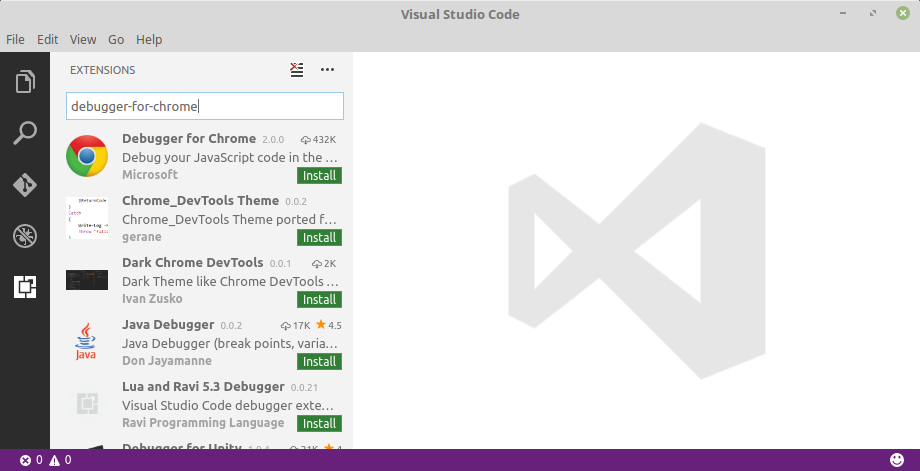
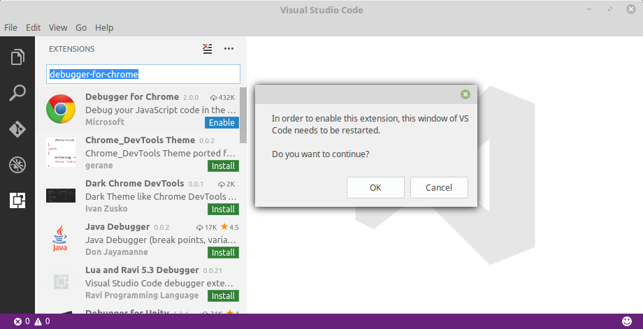
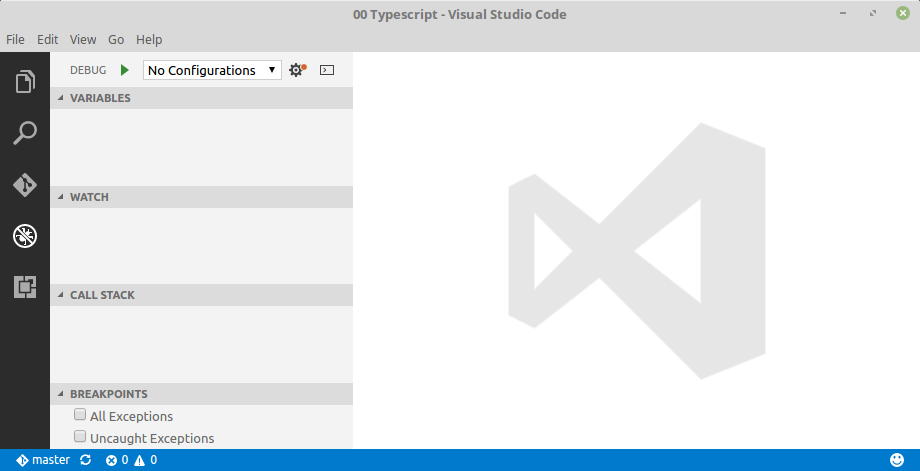
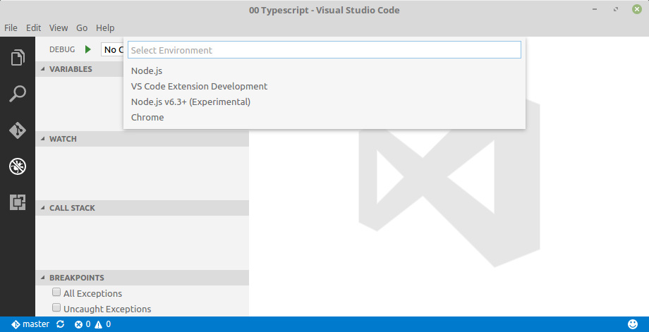
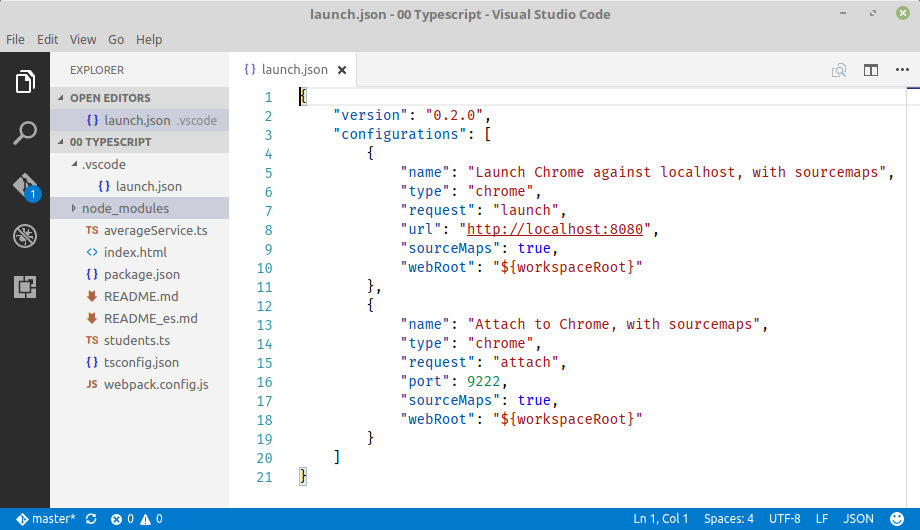

# Debugging with Visual Studio code

In this guide we'll show how to debug client side TypeScript applications in VS Code.

To do this, we'll use [Debugger for chrome](https://github.com/Microsoft/vscode-chrome-debug)
a VS Code extension to debug JavaScript code in the Google Chrome browser, or other targets that support the
[Chrome Debugging Protocol](https://chromedevtools.github.io/debugger-protocol-viewer/).

## Summary Steps

1. Install `Debugger for chrome` extension.
2. Configure the extension.
3. Debug TypeScript code.

## Install

First of all, install the [VS Code Debugger for Chrome Extension](https://marketplace.visualstudio.com/items?itemName=msjsdiag.debugger-for-chrome).

Launch VS Code, press `Ctrl+P`, paste the following command, and press enter.

```
ext install debugger-for-chrome
```




After that, enable the extension (You will prompted to restart VS Code in order to enable the extension).



## Configuring the extension

To use this extension, you must first open the folder containing the project you want to work on.

> In this guide we are using the sample **"02 FX / 00 TypeScript"** from the GitHub project [Webpack 1.x samples](https://github.com/Lemoncode/webpack-1.x-by-sample) by [Lemoncode](http://www.lemoncode.net/).

Click now on the debug icon in the sidebar or press `CTRL+SHIFT+D`.



Then click on the gear icon next to the debug button in the upper left and select `Chrome`.



This opens the debug configuration settings (in `.vscode/launch.json`) with de default
configuration settings.



The extension operates in two modes:
* `launch` - Launch an instance of Chrome and navigate to your app.
* `attach` - Attach to a running instance of Chrome (with remote debugging enabled).

Now we are ready to debug our TypeScript application.

## Debugging JavaScript code
